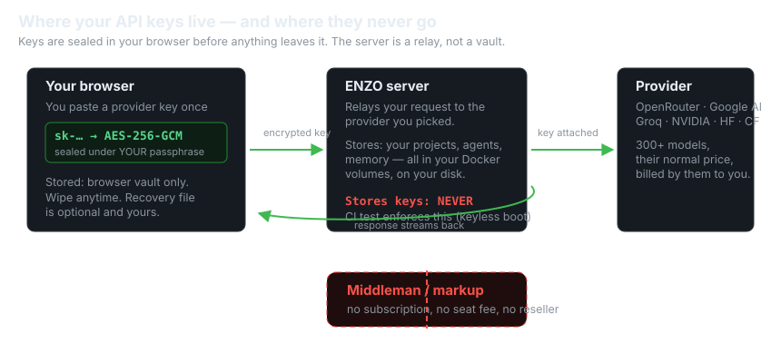

# ENZO

<p align="center">
  
</p>

> When you send a message, the request goes from your browser through ENZO to the provider you picked, and you pay that provider their normal price. **Nothing sits in between taking a cut.**

A self-hostable, bring-your-own-key AI workspace — chat with 300+ models, research, code-gen with live preview, **custom agents that draft and train themselves**, and a local agent with durable memory. All keys stay in *your* browser, encrypted; this server stores none of them.

[](https://github.com/theguysudo/ENZO/actions/workflows/ci.yml)
[](LICENSE)
[](#ci)
[](#quickstart)
[](#quickstart)
[](#why-enzo)

```bash
docker compose up -d
# → http://localhost:5001
```

That's the whole install. No accounts, no mandatory env, no database server.

> Try it hosted first: **https://enzo-hub.duckdns.org** — the same app, running on our infrastructure. This repo is exactly that code, minus Google sign-in (self-hosted login is just your provider keys) with a trimmed default theme set for a small download.

## Why ENZO stands out

Most "AI workspaces" hold your keys, meter your usage, or need a subscription to exist. ENZO is built the other way around:

<p align="center">
  
</p>

| | ENZO | Hosted AI apps (ChatGPT, Poe, …) | Typical self-hosted AI tools |
|---|---|---|---|
| Who pays the model | you, directly to the provider | the vendor (plus markup) | you |
| Where API keys are stored | **your browser only**, AES-256-GCM under your passphrase | vendor's servers | server-side env/config |
| Server sees your keys | **never** — relay-only, CI-enforced | yes | usually yes |
| Middleman fee | none | subscription / per-seat | none |
| Install | `docker compose up -d`, zero config | none (it's hosted) | often multi-service setup |
| Self-improving agents | neural layer learns from your activity | no | no |
| Security testing in CI | black-box pentest, 44 asserts, every push | opaque | rarely |

*(Competitor column is about the category, not specific products — details vary.)*

## What's new in v1.1.0

- **Custom Agent Builder** — describe a task in plain English ("an agent that researches MUN country positions") and it builds itself: a two-pass drafter analyzes the domain, then a free model from *your own* providers writes a 30-year-veteran operating manual (tacit knowledge, decision heuristics, edge cases). You can also create agents straight from chat ("create an agent that…").
- **Self-improving agents (neural layer)** — every agent keeps learning from your platform activity, whether you run it or not: a per-agent neural weight vector folds in domain-matched traffic every 90s, deep-tunes lessons into memory on a cadence, and injects a live NEURAL FOCUS block into every run. Watch it in the agent's **Neural** tab and train it on demand.
- **Race drafting** — when a draft needs a model, ~10 free candidates fire at once and the first to answer wins; a brain-health scoreboard remembers which models actually work and reorders future races. Dead/failing free-tier models can no longer collapse a draft to a generic template.
- **First-key claim bootstrap** (described above) — a fresh `docker compose up` unlocks the full platform from the web UI alone.
- **Honest provenance** — every agent records which model actually drafted it; when nothing was reachable, it says so instead of pretending.
- **~20 hardening fixes** across the terminal, agents UI and onboarding — research steps survive interrupted streams, tab switches no longer lose agent conversations, agent runs carry full conversation history (multi-turn confirm flows complete), reasoning models get proper token headroom, and the Google AI Studio key is fully optional in the self-hosted edition.
- Full changelog: [`docs/CHANGELOG.md`](docs/CHANGELOG.md).

## Quickstart

```bash
# requires docker (or docker compose v2)
git clone https://github.com/theguysudo/ENZO.git
cd enzo
docker compose up -d
```

Open http://localhost:5001, press **Login**, and pick any provider:

| Provider | What you need | Free tier |
|---|---|---|
| [OpenRouter](https://openrouter.ai/keys) | API key | many free models |
| [Google AI Studio](https://aistudio.google.com/apikey) | API key | generous free tier |
| [NVIDIA NIM](https://build.nvidia.com) | API key | free credits |
| Groq, HuggingFace, Cloudflare, Gemini | API key / OAuth | varies |

Keys are saved encrypted in your browser (passphrase-protected vault, with a recovery file you can download). The server never sees them — requests are relayed with your key attached, and you can wipe them anytime from the Vault.

On a fresh self-hosted instance the **first live-validated key you paste claims the instance** — it's written to the container `.env` and sealed (AES-256-GCM) into the `enzo-memory` volume, so every server-side feature (agents, skills, memory) unlocks immediately and survives restarts. No master key to configure, no setup wizard — paste a working key and go. (Pre-seed a provider key in compose env instead if you'd rather not have the claim window at all.)

## CI

Every push to `main` runs the full pipeline in [`.github/workflows/ci.yml`](.github/workflows/ci.yml) — 7 stages:

1. **Security checks** — no key literals in tracked files, `.env` never committed, keys never read from raw `localStorage`, no onboarding bypasses
2. **Backend** — strict TypeScript, every imported file tracked, unit tests (298 assertions across agent, vault, crypto and model suites)
3. **Dependency audits** — backend + frontend, **fail on any high/critical vulnerability**
4. **Black-box security pentest** — 44 live assertions against a booted server: auth bypass, hostile payloads, IDOR, stream integrity
5. **Keyless boot proof** — the server must boot with zero provider keys (that's the BYOK guarantee, tested, not promised)
6. **Frontend** — strict TS + production build with an enforced gzipped bundle budget
7. **Repo hygiene** — no large binaries, changelog and agent docs present

## Two editions

| | `latest` / `lite` | `full` |
|---|---|---|
| Homepage background | Nebula drift — animated WebGL | + 8 anime video themes |
| Workspace/terminal background | Default Particles — animated three.js | + 9 cinematic video themes |
| Image download | ~150 MB | ~470 MB |

Both animate by default — the lite themes are GPU shaders, not static images. To get every theme:

```bash
ENZO_IMAGE=ghcr.io/theguysudo/enzo:full docker compose up -d
```

## What's stored where

Everything you make lives in Docker **named volumes**, safe across upgrades:

- `enzo-projects` — generated coding projects
- `enzo-skills` — skills the agent learned from GitHub repos
- `enzo-memory` — the agent's durable notes about your work

Your provider keys are **not** in the volumes — they're browser-side (encrypted at rest with your passphrase).

## Optional configuration

Everything works with zero environment variables. A few features want server-side values — put them in a `.env` next to `docker-compose.yml`:

```bash
# Extra origins allowed to call the API (comma-separated)
ENZO_CORS_ORIGINS=https://enzo.example.com

# "Connect with Cloudflare" OAuth button (optional — pasting a token works too)
CLOUDFLARE_OAUTH_CLIENT_ID=...
CLOUDFLARE_OAUTH_CLIENT_SECRET=...

# HuggingFace OAuth app for the HF onboarding step (optional — token paste works)
VITE_HF_CLIENT_ID=...
HF_CLIENT_SECRET=...
```

> `VITE_HF_CLIENT_ID` only takes effect when building the image from source (it's baked into the frontend at build time).

### Building from source

```bash
docker build -t enzo:mine --build-arg THEME_VARIANT=full .
```

## What's different from the hosted deployment

This image is generated from the same codebase that runs https://enzo-hub.duckdns.org, with exactly two feature differences:

1. **No Google sign-in.** The hosted site offers Google OAuth as a convenience; here, login *is* setting your provider keys. Everything else — providers, research, coding agent, vault, memory, skills — is identical.
2. **Default themes** (lite image). The first homepage and workspace themes run as pure WebGL/three.js so the image stays small. The `full` image has the complete set.

## License

Apache-2.0 — see [LICENSE](LICENSE).
