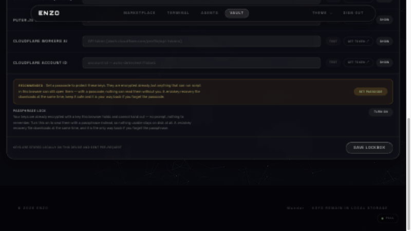

# ENZO — open-source, self-hosted AI workspace

<p align="center">
  
</p>

<p align="center">
  <a href="https://github.com/encoreshao/github-trending/tree/main/docs/topics/llm/2026/09" target="_blank">
    
  </a>
</p>

<p align="center">
  
</p>

<p align="center">
  <a href="#quickstart">Quickstart</a> ·
  <a href="https://enzo-hub.duckdns.org">Live demo</a> ·
  <a href="#six-surfaces-one-workspace">What's inside</a> ·
  <a href="#security">Security</a> ·
  <a href="#whats-new-in-v140">What's new</a> ·
  <a href="#usage-guide">Usage guide</a> ·
  <a href="docs/CHANGELOG.md">Changelog</a>
</p>

<p align="center">
  <a href="https://github.com/theguysudo/ENZO/stargazers"></a>
  <a href="https://github.com/theguysudo/ENZO/blob/main/TRAFFIC.md"></a>
  <a href="https://github.com/theguysudo/ENZO/blob/main/TRAFFIC.md"></a>
  <a href="https://github.com/theguysudo/ENZO/blob/main/TRAFFIC.md"></a>
  <a href="https://github.com/theguysudo/ENZO/blob/main/TRAFFIC.md"></a>
  <a href="https://github.com/theguysudo/ENZO/actions/workflows/ci.yml/badge.svg"></a>
  <a href="LICENSE"></a>
  <a href="#quickstart"></a>
  <a href="#quickstart"></a>
  <a href="#security"></a>
  <a href="https://tdd.cat"></a>
  <a href="https://openalternative.co/enzo"></a>
  <a href="https://agentspace.cc/tool/enzo"></a>
  <a href="https://followagents.com/en/agents/enzo"></a>
  <a href="https://news.lavx.hu/article/self-hosted-ai-workspace-enzo-runs-300-models-on-your-own-keys-with-no-middleman"></a>
  <a href="https://revesery.com/@alex/how-to-set-up-the-enzo-self-hosted-ai-workspace-muffcxe4"></a>
  <a href="https://www.linkedin.com/posts/daniel-kornas_your-ai-workspace-doesnt-need-to-sit-between-activity-7508321788356046848-iyST"></a>
  <a href="https://www.facebook.com/ncybersec/posts/enzo-a-self-hosted-bring-your-own-key-ai-workspace-for-chatting-with-300-models-/1507565364732231/"></a>
</p>

> **Chat with 300+ models. Build agents that write their own operating manuals. Research, generate code, run it all — on your keys, on your infrastructure.** When you send a message, the request goes from your browser through ENZO to the provider you picked, and you pay that provider their normal price. **Nothing sits in between taking a cut.** There is no ENZO account, no usage meter, no subscription.

## What's inside

| Inside ENZO | Count | What it gives you |
|---|---:|---|
| Models in one catalog | 300+ | across 9 providers, health-checked live |
| Injectable agent skills | 74 bundled | domain playbooks the agent loop pulls in per run |
| Self-drafting agents | 2-pass builder | plain-English task in, operating manual out |
| CI pipeline stages | 7 | including a black-box security pentest on every push |
| Pentest assertions | 44 | auth bypass, IDOR, hostile payloads, stream integrity |
| Unit + security tests | 298 | agent, vault, crypto and model suites |
| TypeScript (strict) | ~44,000 lines | one language, strict mode throughout |
| Releases | 5 | v1.0.0 → v1.4.0, everything in the [changelog](docs/CHANGELOG.md) |

## Quickstart

```bash
git clone https://github.com/theguysudo/ENZO.git
cd enzo
docker compose up -d
# → http://localhost:5001
```

No clone? One command (mounts the same named volumes, so your data and the claimed instance survive restarts and upgrades):

```bash
docker run -d -p 5001:5001 --name enzo \
  -v enzo-projects:/app/generated-projects \
  -v enzo-skills:/app/src/skills/skills \
  -v enzo-memory:/app/data \
  ghcr.io/theguysudo/enzo:latest
```

That's the whole install. No accounts, no mandatory env, no database server. Open the app, press **Login**, and pick any provider:

| Provider | What you need | Free tier |
|---|---|---|
| [OpenRouter](https://openrouter.ai/keys) | API key | many free models |
| [Google AI Studio](https://aistudio.google.com/apikey) | API key | generous free tier |
| [NVIDIA NIM](https://build.nvidia.com) | API key | free credits |
| Groq, HuggingFace, Cloudflare, Gemini | API key / OAuth | varies |

Keys are saved encrypted in your browser (passphrase-protected vault, with a recovery file you can download). You can wipe them anytime from the Vault.

On a fresh self-hosted instance the **first live-validated key you paste claims the instance** — it's written to the container `.env` and sealed into the `enzo-memory` volume, so every server-side feature (agents, skills, memory) unlocks immediately and survives restarts. No master key to configure, no setup wizard — paste a working key and go. (Pre-seed a provider key in compose env instead if you'd rather not have the claim window at all; the [threat model](#security) states this trade plainly.)

> [!TIP]
> Try it hosted first: **https://enzo-hub.duckdns.org** — the same app, running on our infrastructure. This repo is exactly that code, minus Google sign-in (self-hosted login is just your provider keys) with a trimmed default theme set for a small download.

## Run on Google Colab — zero install

[](https://colab.research.google.com/github/theguysudo/ENZO/blob/main/notebooks/enzo-colab.ipynb)

Don't want the local hassle — or want ENZO reachable from any device? The Colab notebook does the whole setup for you: it clones this repo, installs the dependencies, builds the UI and boots the server, then hands you a URL.

1. **Click the button** — the notebook opens in Colab (a free Google account is enough).
2. **Run all cells** (`Runtime → Run all`, or `Ctrl/⌘ + F9`) — install + build takes ~4–5 min the first time; every cell is idempotent, so a re-run reuses what's already there instead of starting over.
3. **Take your URL** — the last cell prints two links: a **Colab link** that works in the browser you're already in, and a **Cloudflare tunnel link** that works from your phone or any other device (free, no account). The tunnel URL changes each session; the Colab link is bound to your session.

**Stays up for the whole session.** The notebook arms two disconnect-prevention mechanisms before handing you the URL: a **keep-alive** that resets Colab's ~90-minute idle timer every 60 seconds while the tab is open, and a **watchdog thread** that pings the server every 5 minutes and restarts it automatically if it ever dies. Free Colab caps a session at ~12 hours, so a 6-hour run fits comfortably; when a session does end, one click on **Run all** brings everything back.

> [!NOTE]
> The notebook runs on Google's hardware, so Colab's terms apply while you're there — but your **model keys stay yours**: paste any provider key after boot, exactly like self-hosting, and nothing is ever stored on our side. When the Colab session ends, everything on the VM is gone.

## Six surfaces, one workspace

| Surface | What it does |
|---|---|
| **Terminal** | Streaming chat with 300+ models — normal, thinking, research and coding modes — with a live ECG-style health trace in the toolbar that flatlines red the moment the catalog is unreachable |
| **Model marketplace** | One unified catalog across all 9 providers — cards now carry the platform's own cover art and a research panel with real download counts, licences and benchmarks |
| **Music player** | Search any song and play it in the marketplace — keyless, no YouTube API key — with a 5-band equalizer that actually re-shapes the audio |
| **Agent builder** | Describe a task in plain English; ENZO drafts the agent's full operating manual, and the agent keeps training itself on your activity from then on |
| **Research mode** | A deep-research loop that writes its own queries, reads what it finds, and decides when it's done — under hard budgets so it can't burn your key |
| **Code-gen** | Writes a coding project, boots it, previews it live, and tells you when it's broken |
| **Vault** | Every key sealed in the browser, attached per-request, wipeable in one click |

### How the agent builder works

1. **Pass 1 — analysis.** A two-pass drafter reads the domain of your task ("an agent that researches MUN country positions") and derives what the manual needs to cover: tacit knowledge, decision heuristics, edge cases.
2. **The race.** When a draft needs a model, ~10 free candidates from *your own* providers fire simultaneously — the first to answer wins, stragglers are aborted, and a brain-health scoreboard reorders future races by which models actually deliver. Dead or rate-limited free-tier models can no longer collapse a draft.
3. **Honest provenance.** Every agent records which model actually drafted it — and says so plainly when nothing was reachable.
4. **It doesn't stop.** A per-agent neural layer folds in domain-matched platform activity on a 90-second cadence, distills lessons into memory, and injects a live NEURAL FOCUS block into every run. Watch it in the agent's **Neural** tab.

## Why ENZO stands out

Most "AI workspaces" hold your keys, meter your usage, or need a subscription to exist. ENZO is built the other way around:

| | ENZO | Hosted AI apps (ChatGPT, Poe, …) | Typical self-hosted AI tools |
|---|---|---|---|
| Who pays the model | you, directly to the provider | the vendor (plus markup) | you |
| Where API keys live | your browser, AES-256-GCM sealed under a **non-extractable** key | vendor's servers | server-side env/config |
| Server reads your keys | **hosted mode: never** — relay-only, CI-enforced. Self-hosted: only the key you explicitly claim, for scheduled agents — stated in the [threat model](docs/SECURITY.md) | yes | usually yes |
| Middleman fee | none | subscription / per-seat | none |
| Install | `docker compose up -d`, zero config | none (it's hosted) | often multi-service setup |
| Agents improve themselves | neural layer learns from your activity | no | no |
| Security testing in CI | black-box pentest, 44 asserts, every push | opaque | rarely |

*(Competitor column is about the category, not specific products — details vary.)*

**Comparing specific alternatives?** ENZO sits in the self-hosted, bring-your-own-keys family next to LibreChat (multi-provider chat), AnythingLLM (local RAG workspace), LobeChat (plugin ecosystem) and the Dify / Flowise visual workflow builders. The difference is the agent layer: agents here write their own operating manuals, keep training on your activity, and the whole stack installs as one zero-config container — with nothing between you and the provider taking a cut.

## Security

The full threat model is written down — checkable, with the code that makes each claim true — in [docs/SECURITY.md](docs/SECURITY.md). The short version:

- **Keys are sealed in your browser with AES-256-GCM under a non-extractable WebCrypto key.** It can be *used* to decrypt your keys while never being *copied* — no JavaScript can export its bytes, ours or an attacker's. Optional passphrase mode re-seals everything under PBKDF2-SHA256 (600,000 iterations) and deletes the device key entirely.
- **One module touches key storage, and CI enforces it.** A pipeline stage greps the frontend for any raw `localStorage` key read and fails the build on a hit — a missed key-access site is a red build, never a production bug.
- **Every push runs a 44-assertion black-box pentest** against a booted server — auth bypass, hostile payloads, IDOR, stream integrity — plus a keyless-boot proof: the server must start with zero provider keys. That's the BYOK guarantee, tested, not promised.
- **The limits are stated up front.** Self-hosted mode stores the first key you claim in the container `.env` (sealed in the memory volume) so scheduled agents can run while your browser is closed — that trade is documented, not hidden. [docs/SECURITY.md](docs/SECURITY.md) covers what's protected, what isn't, and why.

## What's new in v1.4.0

- **In-chat file converter** — attach a PDF, spreadsheet, CSV, JSON, TXT or Markdown file in the terminal chat and it's parsed to real text/rows in your browser (files never leave the device; only the reasoning step uses your own key, like normal chat). The agent extracts, merges, or cross-converts — and **CSV / Excel download buttons appear right on the reply**. Built for research papers: "extract every table and merge into one CSV" now works end to end, and scanned PDFs report their missing text layer instead of failing.
- **Run it on Google Colab** — one click on the **Open In Colab** button (see [Run on Google Colab](#run-on-google-colab--zero-install)): the notebook clones, installs, builds and boots ENZO on Google's hardware, hands you a URL for your browser plus a tunnel URL for your phone, and arms a keep-alive + watchdog so it stays up for 6+ hours.
- **Self-healing Docker pulls** — the container now verifies its dependencies on every start and installs anything missing before the server boots (`ENZO_AUTO_INSTALL=0` to skip). A pulled image can't boot broken.

## What's new in v1.3.0 (previous)

- **Music player** — search any song and play it straight from the marketplace, keyless (no YouTube API key, no quota): a collapsed corner pill expands into a full player card — vinyl disc hero, queue walking, shuffle/loop/like, keyboard controls. **For You** turns your own listening history (kept device-local) into song seeds through your own provider key.
- **Real equalizer** — a 5-band Web Audio EQ (bass / low-mid / mid / presence / air, ±12 dB, preamp, five presets) that genuinely re-shapes the frequency response when you opt in. Enhance starts **off** — normal playback is untouched. Tracks the enhancer can't stream fall back to the YouTube engine automatically; playback never breaks.
- **Marketplace, redesigned** — every model card now carries the platform's own cover art, brand colour on hover, live health dot + latency, and a research panel with real facts: HuggingFace download counts, licences, knowledge cutoffs, Artificial Analysis scores and a Wikipedia-backed family summary — pulled keyless from public endpoints, never guessed.
- **NYC Subway theme** — the workspace's new flagship backdrop: an AI-animated subway ride through a tunnel, with a handheld-camera tremble, monochrome film grade and animated recording grain added in code (the video ships clean).
- **A quieter interface** — the whole workspace went monochrome + a single coral accent: the terminal toggle switch rebuilt (was a 385-line component with dead animations), the weather chip moved up beside the catalog header, the nav collapses on scroll and springs back, and the top bar got a cursor-reactive dot grid.
- Previously in [v1.2.0](https://github.com/theguysudo/ENZO/releases/tag/v1.2.0): the terminal health ECG, the onboarding stepper, ambient weather, the smoke top bar.
- Full history: [`docs/CHANGELOG.md`](docs/CHANGELOG.md).

## Usage guide

### macOS

**Requirements:** [Docker Desktop for Mac](https://www.docker.com/products/docker-desktop/) (Apple Silicon or Intel). Allocate at least 4 GB RAM in Docker Desktop → Settings → Resources (the model catalog + agents like headroom).

```bash
git clone https://github.com/theguysudo/ENZO.git
cd ENZO
docker compose up -d
```

Open **http://localhost:5001**, press **Login**, and paste a key from any provider (OpenRouter, Google AI Studio, NVIDIA NIM — all have free tiers; links are in the app). You're in.

**Everyday commands**

```bash
docker compose logs -f          # follow what the server is doing
docker compose restart          # bounce the app, data survives
docker compose pull && docker compose up -d   # upgrade to a new release
docker compose down             # stop (add -v ONLY to wipe all data)
```

**Where your stuff lives:** projects, learned skills and agent memory are in named Docker volumes (`docker volume ls | grep enzo`) — they survive upgrades and `down`. Your provider keys never touch the server: they're sealed in your browser's vault, and on a fresh install the first key you paste claims the instance for server-side features (scheduled agents).

**If the app feels slow on a MacBook**: the video themes are GPU-composited; on battery or an older machine, flip the **Lite/Full** chip (bottom-right) — it swaps video backgrounds for pure shader ones with one click.

**Updating:** `docker compose pull && docker compose up -d`. Releases are tagged at [github.com/theguysudo/ENZO/releases](https://github.com/theguysudo/ENZO/releases).

### Windows

**Requirements:** [Docker Desktop for Windows](https://www.docker.com/products/docker-desktop/) with WSL 2 (Docker Desktop's installer sets this up; reboot when it asks). Give it ≥ 4 GB RAM in Settings → Resources.

In **PowerShell** (no clone folder needed — `git` comes with Docker Desktop's WSL distro, or use [Git for Windows](https://git-scm.com/download/win)):

```powershell
git clone https://github.com/theguysudo/ENZO.git
cd ENZO
docker compose up -d
```

Open **http://localhost:5001** in your browser, press **Login**, paste a provider key — done.

**Everyday commands**

```powershell
docker compose logs -f          # follow the server log
docker compose restart          # bounce the app
docker compose pull; docker compose up -d   # upgrade to a new release
docker compose down             # stop (add -v ONLY to wipe all data)
```

**Windows notes**

- If `http://localhost:5001` doesn't load, check Docker Desktop is running (whale icon in the system tray), then `docker compose ps` — the port is listed there.
- Anti-virus software occasionally slows the first boot (image extraction). The second start is fast.
- Everything else — volumes, keys, the Lite/Full chip — works exactly as on macOS.

### Linux (same everywhere)

```bash
git clone https://github.com/theguysudo/ENZO.git
cd ENZO && docker compose up -d   # → http://localhost:5001
```

## What's new in v1.2.0 (previous)

- **Live terminal health ECG** — the static ONLINE label is now a heart-monitor trace sweeping the terminal toolbar; reachable catalog keeps it beating, anything else freezes a red flatline.
- **Onboarding, rebuilt** — an animated stepper walks the three connect-provider steps (numbers morph into checkmarks, completed steps are click-back-navigable), with a liquid save switch that ticks when your key lands.
- **Ambient weather card** in the marketplace sidebar — one keyless IP geolocation + Open-Meteo, cached 30 minutes, degrading quietly.
- **Smoke behind the glass** — the top bar carries a slow violet/cyan drift (WebGL fbm, low-power context) and a ~20% slimmer silhouette.
- Previously in [v1.1.0](https://github.com/theguysudo/ENZO/releases/tag/v1.1.0): the custom agent builder, race drafting, the neural layer, and ~20 hardening fixes.
- Full history: [`docs/CHANGELOG.md`](docs/CHANGELOG.md).

## CI

Every push to `main` runs the full pipeline in [`.github/workflows/ci.yml`](.github/workflows/ci.yml) — 7 stages:

<p align="center">
  
</p>

1. **Security checks** — no key literals in tracked files, `.env` never committed, keys never read from raw `localStorage`, no onboarding bypasses
2. **Backend** — strict TypeScript, every imported file tracked, unit tests (298 assertions across agent, vault, crypto and model suites)
3. **Dependency audits** — backend + frontend, **fail on any high/critical vulnerability**
4. **Black-box security pentest** — 44 live assertions against a booted server: auth bypass, hostile payloads, IDOR, stream integrity
5. **Keyless boot proof** — the server must boot with zero provider keys
6. **Frontend** — strict TS + production build with an enforced gzipped bundle budget
7. **Repo hygiene** — no large binaries, changelog and agent docs present

## Two editions

| | `latest` / `lite` | `full` |
|---|---|---|
| Homepage background | Nebula drift — animated WebGL | + 8 anime video themes |
| Workspace/terminal background | Default Particles (three.js) + the NYC Subway ride | + 9 cinematic video themes |
| Image download | ~150 MB | ~470 MB |

Both animate by default — the lite themes are GPU shaders, not static images. To get every theme:

```bash
ENZO_IMAGE=ghcr.io/theguysudo/enzo:full docker compose up -d
```

## What's stored where

Everything you make lives in Docker **named volumes**, safe across upgrades:

- `enzo-projects` — generated coding projects
- `enzo-skills` — skills the agent learned from GitHub repos
- `enzo-memory` — the agent's durable notes about your work

Your provider keys are **not** in the volumes — they're browser-side (encrypted at rest with your passphrase).

## Optional configuration

Everything works with zero environment variables. A few features want server-side values — put them in a `.env` next to `docker-compose.yml`:

```bash
# Extra origins allowed to call the API (comma-separated)
ENZO_CORS_ORIGINS=https://enzo.example.com

# "Connect with Cloudflare" OAuth button (optional — pasting a token works too)
CLOUDFLARE_OAUTH_CLIENT_ID=...
CLOUDFLARE_OAUTH_CLIENT_SECRET=...

# HuggingFace OAuth app for the HF onboarding step (optional — token paste works)
VITE_HF_CLIENT_ID=...
HF_CLIENT_SECRET=...
```

> `VITE_HF_CLIENT_ID` only takes effect when building the image from source (it's baked into the frontend at build time).

### Building from source

```bash
docker build -t enzo:mine --build-arg THEME_VARIANT=full .
```

## What's different from the hosted deployment

This image is generated from the same codebase that runs https://enzo-hub.duckdns.org, with exactly two feature differences:

1. **No Google sign-in.** The hosted site offers Google OAuth as a convenience; here, login *is* setting your provider keys. Everything else — providers, research, coding agent, vault, memory, skills — is identical.
2. **Default themes** (lite image). The first homepage and workspace themes run as pure WebGL/three.js so the image stays small. The `full` image has the complete set.

## Where ENZO has been mentioned

- **GitHub Trending** (LLM topic), Sep 9–10 2026 — **#17 on Sep 9 → #19 on Sep 10**. Evidence: [the per-topic trending archive (the two CSV rows)](https://github.com/encoreshao/github-trending/tree/main/docs/topics/llm/2026/09) · [an independent digest's ranked trending table — #9, Sep 8–9](https://github.com/Piyush0053/ai-daily-digest/blob/main/digests/2026-09-08.md)
- **[The Daily Diff](https://tdd.cat)** — "ENZO brings self-hosted AI workspace with agents and BYOK" (Sep 19, 2026)
- **[OpenAlternative](https://openalternative.co/enzo)** — listed as an open-source, self-hosted alternative
- **[agentspace.cc](https://agentspace.cc/tool/enzo)** · **[followagents.com](https://followagents.com/en/agents/enzo)** — agent directory listings
- **[The Lavx News](https://news.lavx.hu/article/self-hosted-ai-workspace-enzo-runs-300-models-on-your-own-keys-with-no-middleman)** — "Self-hosted AI workspace: ENZO runs 300+ models on your own keys, with no middleman"
- **[Revesery](https://revesery.com/@alex/how-to-set-up-the-enzo-self-hosted-ai-workspace-muffcxe4)** — a community setup guide
- **Daniel Kornas** on [LinkedIn](https://www.linkedin.com/posts/daniel-kornas_your-ai-workspace-doesnt-need-to-sit-between-activity-7508321788356046848-iyST) and [X](https://x.com/DanKornas/status/2102555791739761116) — "Your AI workspace doesn't need to sit between you and your model provider"
- **[ncybersec](https://www.facebook.com/ncybersec/posts/enzo-a-self-hosted-bring-your-own-key-ai-workspace-for-chatting-with-300-models-/1507565364732231/)** and **[elbonay.duredeyef](https://www.facebook.com/elbonay.duredeyef/posts/your-ai-workspace-doesnt-need-to-sit-between-you-and-your-model-providerenzo-is-/29148675744717250/)** on Facebook
- Curated lists that merged the addition: [awesome-opensource-ai](https://github.com/alvinreal/awesome-opensource-ai) · [Awesome-AI-Agents](https://github.com/Jenqyang/Awesome-AI-Agents) · [awesome-ai-web-search](https://github.com/felladrin/awesome-ai-web-search) · [awesome-gpt](https://github.com/awesome-gptX/awesome-gpt)

## License

Apache-2.0 — see [LICENSE](LICENSE).

---

<p align="center">
  <strong>One command. Your keys. No middleman.</strong><br/>
  <code>docker compose up -d</code> → http://localhost:5001 · or try it live at <a href="https://enzo-hub.duckdns.org">enzo-hub.duckdns.org</a><br/><br/>
  <sub>If ENZO saves you a middleman, a ⭐ helps other people find it.</sub>
</p>
