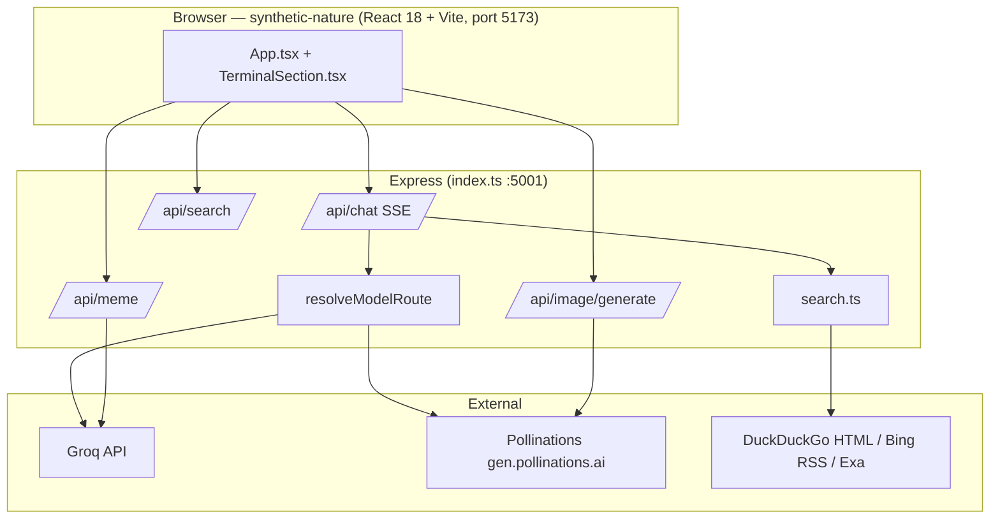

# ENZO Project Report

**Project:** ENZO // DEDSEC AI Interface  
**Location:** `/Users/aditya/backend`  
**Report date:** July 2026  
**Version:** 1.0.0 (package.json)

---

## 1. Executive summary

ENZO is a locally hosted AI chat, image generation, and model marketplace web application with a Watch Dogs / DedSec aesthetic. A single Express server proxies requests to external LLM and image APIs so API keys never reach the browser. The backend is TypeScript + Express; the primary frontend is a React/Vite app (`synthetic-nature/`) with WebGL animated backgrounds and a full marketplace.

The project delivers:

- Multi-model chat with SSE streaming responses (nine providers: OpenRouter, Groq, HuggingFace, NVIDIA NIM, Pollinations, LLM7, Google Gemini, Puter, Cloudflare Workers AI)
- Optional chain-of-thought, research, and coding modes
- Free web search via DuckDuckGo (plus Exa when `EXA_API_KEY` is set)
- Text-to-image and image-to-image generation via Pollinations
- AI-generated meme roasts with configurable frequency
- A model marketplace with live catalog of 1,600+ models across 9 providers
- An OpenAI-compatible AI Tunnel API (`/api/v1/chat/completions`)
- HuggingFace free serverless inference for ~140 chat/instruct models
- A Vault for user-provided API keys (all nine chat providers + Exa search)

Primary use case: personal local AI workstation with free-tier providers and a premium React frontend.

---

## 2. System architecture



### 2.1 Technology stack

| Layer | Technology |
|-------|------------|
| Runtime | Node.js 20 |
| Server | Express 5 |
| Language | TypeScript (backend), TypeScript + TSX (React frontend) |
| Execution | tsx (no compile step for backend) |
| Frontend | React 18 + Vite (`synthetic-nature/` on port 5173) |
| Chat providers | Groq, Pollinations, OpenRouter, HuggingFace, NVIDIA NIM, LLM7, Puter, Google, Cloudflare |
| Image provider | Pollinations (`gen.pollinations.ai` + `image.pollinations.ai`) |
| Search | Exa (keyed) → DuckDuckGo HTML → Bing RSS (both keyless) |
| 3D / Graphics | Three.js + custom WebGL shaders (animated sky/environment backgrounds) |
| Persistence | Browser localStorage (keys, settings) + server files (sealed tokens `0o600`, durable memory notes, project files) |
| Styling | Tailwind CSS + custom CSS in the React frontend |

### 2.2 Directory structure

| Path | Role |
|------|------|
| `index.ts` | Server bootstrap, all API routes, model routing, image pipeline |
| `src/features/tunnel.ts` | Decoupled OpenAI-compatible AI Tunnel middleware (`/api/v1/`) |
| `src/models/model-sync.ts` | Multi-provider model discovery and catalog caching |
| `src/agent/search.ts` | Web search (Exa keyed; DuckDuckGo/Bing RSS keyless fallbacks) |
| `src/agent/agent-tools.ts` | Agent tool loop (web search, deep research, Gmail, Calendar, …) |
| `src/projects/project.ts` | Multi-file project host (`/api/project/*`) |
| `synthetic-nature/` | Primary React/Vite frontend (port 5173) |
| `docs/` | Project documentation and changelogs |
| `docs/AGENTS.md` | OpenCode / Antigravity agent instructions |

---

## 3. Feature inventory

### 3.1 Chat (`POST /api/chat`)

**Protocol:** Server-Sent Events (SSE)

**Request body:**

```json
{
  "message": "string (required)",
  "chosenModel": "" | "deepseek-70b" | "llama-70b" | "minimax" | "claude",
  "chatMode": "normal" | "thinking" | "research" | "coding",
  "webSearch": "auto" | "on" | "off"
}
```

**Response events:**

| Event | Payload | When |
|-------|---------|------|
| (default) | Text chunk | Assistant output |
| `reasoning` | Text chunk | Thinking mode / MiniMax |
| `search` | Status string | Web search lifecycle |

**System persona:** "Enzo" — DedSec AI assistant; direct, formatted prose; no meta disclaimers.

**Stream sanitization:** Non-reasoning Groq streams pass through `StreamSanitizer` to strip ``-style tags.

### 3.2 Model matrix (fixed sidebar models)

| UI label | Route ID | Provider | Backend model | Max tokens | Notes |
|----------|----------|----------|---------------|------------|-------|
| QWEN3-32B | (default) | Groq | `qwen/qwen3-32b` | 1024 | Default, free-tier friendly |
| COMPOUND-B | `deepseek-70b` | Groq | `compound-beta-mini` | 1024 | Replaces decommissioned DeepSeek |
| LLAMA-3.3-70B | `llama-70b` | Groq | `llama-3.3-70b-versatile` | 1024 | General purpose |
| MINIMAX-M3 | `minimax` | Pollinations | `minimax-m3` | 2048 | Uses Pollen credits |
| CLAUDE-S | `claude` | Groq | `llama-3.3-70b-versatile` | 1536 | Style prompt only — not Anthropic |

### 3.2a Marketplace catalog models (dynamic)

The marketplace exposes 1,600+ models across 9 providers, discovered via live API sync (counts below from the last local `model-cache.json` snapshot — live counts drift as catalogs change; Google/Groq/Cloudflare appear only when a key is present):

| Provider | Count | Source | Auth |
|----------|-------|--------|------|
| Puter | ~840 | `api.puter.com/puterai/chat/models/details` | User-pays Puter token |
| Pollinations | ~414 | `gen.pollinations.ai/models` | Pollen credits |
| OpenRouter | ~391 | `openrouter.ai/api/v1/models` | Keyless catalog; user OR key for chat |
| HuggingFace | ~140 | HF auto-router (`router.huggingface.co/v1/models`) | Free HF token |
| NVIDIA NIM | ~82 | NVIDIA API catalog (build.nvidia.com + NGC pagination) | User NVIDIA key |
| LLM7 | ~35 | `api.llm7.io/v1/models` | LLM7 key (no anonymous chat) |
| Groq | 0–30 | `api.groq.com/openai/v1/models` | User/server Groq key |
| Google | keyed only | `generativelanguage.googleapis.com/v1beta/openai/models` | `GEMINI_API_KEY` |
| Cloudflare | keyed only | `api.cloudflare.com/client/v4/accounts/{id}/ai/models/search` | CF token + account id |

**Mode overrides:**

| Mode | Default model | MiniMax selected |
|------|---------------|------------------|
| Thinking | Qwen + parsed reasoning | MiniMax + reasoning SSE |
| Research | compound-beta-mini | MiniMax, 3072 tokens |
| Coding | Qwen + coding prompt | MiniMax + coding prompt |

### 3.3 Web search

- **Backends, in order:** Exa neural search (best results, needs a user key) → DuckDuckGo HTML scrape → Bing RSS (both keyless) — the keyless path always works
- **Implementation:** `src/agent/search.ts` (`searchWeb`); the agent tool-loop exposes the same machinery to the model as `web_search` / `deep_research` tools
- **Injection:** Results appended to the system prompt before the LLM call
- **Auto-trigger:** Questions, temporal keywords (2025/2026, "latest", "news"), or explicit search intent
- **Cost:** Free tier available (no API key required for the DuckDuckGo/Bing path)
- **Risk:** HTML parsing may break if DuckDuckGo changes markup

### 3.4 Image generation (`POST /api/image/generate`)

| Mode | Trigger | Model fallback chain |
|------|---------|---------------------|
| Text-to-image | `prompt` only | `zimage` → `flux` |
| Image-to-image | `prompt` + base64 `image` | `klein` → `flux` |

- Output: `{ dataUrl, mode: "text2img" | "img2img" }`
- Prompts auto-prefixed with photorealistic enhancement unless already present
- Size: 512×512
- Authentication: Pollinations Bearer token (server-side)

### 3.5 Meme engine (`POST /api/meme`)

- Model: Groq `llama-3.1-8b-instant`
- Returns: `{ text, sub }` JSON roast
- Frontend: React components (`synthetic-nature/src/components/`) — probability based on prompt quality, frequency setting, cooldowns
- Fallback memes if API fails

### 3.6 Settings (client-side)

Mode selection lives in the React frontend as component state, not a stored
settings blob: the terminal footer (`TerminalSection.tsx`) has toggles for
Roast Mode and a `chatMode` of `normal / thinking / research / coding / image-gen`
picked per message. Provider keys live under `enzo.keys.*` in localStorage,
sealed via `keyVault.ts` (AES-256-GCM). Legacy `enzo-settings-v2` from the old
vanilla UI is no longer read.

---

## 4. External dependencies and costs

| Service | Used for | Billing |
|---------|----------|--------|
| Groq | Chat (default models), memes | Free tier with rate limits |
| Pollinations | MiniMax M3, images (`image.pollinations.ai` free, `gen.pollinations.ai` paid) | Pollen credits for gen endpoint |
| OpenRouter | Marketplace chat models | Keyless catalog; user's own OR key for chat |
| HuggingFace | ~140 serverless conversational models | Free HF token (no billing) |
| NVIDIA NIM | NIM inference models | User's own NVIDIA key |
| Puter | ~800 marketplace models | User-pays Puter token |
| LLM7 | ~35 models | LLM7 key (no anonymous chat) |
| Google Gemini | Marketplace models | User's `GEMINI_API_KEY` |
| Cloudflare Workers AI | Marketplace models | User's CF token + account id |
| Exa | Neural web search (primary when keyed) | User's own Exa key |
| DuckDuckGo / Bing | Keyless web search fallbacks | Free |

**Known billing constraints:**

- Pollinations paid image models (e.g. nanobanana) return 402 without Pollen balance
- `flux` and `zimage` work on lower Pollen cost; `turbo` added as fast free fallback
- MiniMax chat consumes Pollinations credits, not Groq quota
- HuggingFace models are free with a token but the shared cluster has rate limits
- OpenRouter and NVIDIA NIM charges are billed directly to the user's own account

---

## 5. Security posture

Full threat model, including what the encryption does **not** cover:
[SECURITY.md](SECURITY.md) in `docs/`. This table is the status summary.

*Last hardened: 2026-08-23.*

| Area | Status | Notes |
|------|--------|-------|
| Provider keys in the browser | ✅ AES-256-GCM at rest | `v1.gcm.<iv>.<ct>` in `localStorage`, sealed under a **non-extractable** `CryptoKey` in IndexedDB. All access funnels through `keyVault.ts`; a CI grep fails the build on any direct `localStorage` hit for an `enzo.keys.*` name. |
| Optional passphrase mode | ✅ Available, off by default | PBKDF2-SHA256 × 600 000; enabling it **deletes the device key**, so nothing usable remains at rest. Default path adds no prompt. |
| Token files on the server | ✅ AES-256-GCM at rest | `crypto-store.ts`, scrypt-derived key, `mode 0o600`. Legacy plaintext read once and re-written sealed. |
| API keys in source | ✅ None | No hardcoded fallbacks. Server boots keyless; the vault UI and per-request headers supply keys. |
| Session auth (Google) | ✅ Fails closed | No fallback JWT secret — unset `JWT_SECRET` ⇒ `503`, not a forgeable token. `jwt.verify` pins `HS256`. |
| Vault / memory / skills / tunnel | ✅ Authenticated | Master key or a vault session token HMAC'd over a rolling 12-hour window. No anonymous access. |
| OAuth CSRF | ✅ Covered | Gmail/Calendar: single-use 10-min `state`. HuggingFace: PKCE + `state`. OpenRouter: PKCE (sufficient — the browser redeems that code directly, no server hop). |
| Generated-code isolation | ✅ Two boundaries | Preview iframe is `allow-scripts` **without** `allow-same-origin` (opaque origin ⇒ `parent.localStorage` throws). Child processes get an explicit env allowlist, not `{...process.env}`. |
| Skill learning | ✅ No execution path | `execFile` clone (no shell), markdown read back only. Nothing from a cloned repo runs. |
| Rate limiting | ⚠️ Correct but single-instance | `trust proxy = 1` so `req.ip` is the real caller behind the tunnel. Buckets are in-process — see §7. |
| CSP | ⚠️ Report-Only, deliberately | One process serves JSON, the SPA, and generated HTML with inline `<script>`; a policy guessed in one pass would break one of them. Observe, then enforce. |
| Other headers | ✅ Set | `nosniff`, `Referrer-Policy`, `X-Frame-Options`, HSTS, `Permissions-Policy`. |
| CORS | ✅ Restricted | `ENZO_CORS_ORIGINS` allowlist; no-Origin requests (curl) allowed by design. |
| Error responses | ✅ Scrubbed | Global Express handler strips internals. |
| Input validation | ⚠️ Basic string checks | Adequate for the current surface; no schema validation layer. |
| Image upload | ✅ Bounded | Base64 in JSON, 12 MB body limit. |
| Verification | ✅ Automated | `npm run pentest` (10 black-box checks), `npm test` (AES round-trip + tamper), `npm run check:imports`. |

---

## 6. Operational guide

### 6.1 Start server

```bash
cd /Users/aditya/backend
npm install   # first time
npm start
```

Open http://localhost:5001

### 6.2 Environment variables

Copy `.env.example` to `.env` and fill in what you need — the server loads it at
boot, so `export` is no longer required. Every variable the code reads is
documented there with its default and what breaks without it.

```bash
cp .env.example .env
```

The only one that changes the app's *shape* rather than a value is
`ENZO_MASTER_KEY`: set ⇒ self-hosted (server holds keys, vault writer enabled),
unset ⇒ hosted/BYOK (server holds nothing, those endpoints fail closed). See
`README.md` → "Which mode am I in?".

### 6.3 Troubleshooting

| Symptom | Cause | Fix |
|---------|-------|-----|
| Port starts then exits | `EADDRINUSE` | `lsof -i :5001 -t \| xargs kill` |
| `[ NO SIGNAL ]` in chat | Backend down or wrong port | Restart server; check 5001 |
| 402 / Insufficient Pollen | Pollinations balance | Top up at enter.pollinations.ai |
| Queue full | Pollinations congestion | Retry after delay |
| Model 404 | Decommissioned Groq ID | Use current mappings in `resolveModelRoute` |
| Settings ✕ not clickable | Cursor z-index conflict | `body.settings-open` hides cursor |
| Grayscale images | CSS filter | Removed in styles — verify no regression |

---

## 7. Technical debt and limitations

Rewritten 2026-08-23. Items 1–9 of the previous list are resolved: the duplicate
`frontend/` tree and `app.js` are gone, `tsconfig.json` and `.gitignore` exist,
`npm test` runs three suites plus a CI import guard, the misleading model naming
is gone, and every provider key is env-configurable.

Ordered by how much it would cost to be wrong about.

1. **`index.ts` (~5.9k lines) and `TerminalSection.tsx` (~4.9k) are not split.**
   This is the largest remaining structural item and it was deliberately deferred:
   both are the highest-traffic files in the project, and carving them up in the
   same pass as the security work would have put every surface of the product at
   regression risk at once. Mitigated for now by searchable section banners and a
   navigation map in each file's header.
   *Next step:* extract the per-provider stream adapters from `index.ts` first —
   they are the only region with a clean interface (request in, SSE frames out)
   and no shared state. Do it as its own change, with the pentest and a full
   manual chat pass on either side.

2. **One global Gmail/Calendar identity.** `.gmail-tokens.json` is a single
   cwd-relative file, so a hosted instance has **one** Google identity shared by
   every visitor — whoever connects last owns it, and every later `gmail_list` /
   `gmail_send` runs against that mailbox. Sealing the file (done) protects it at
   rest but does not change this. Correct for the intended self-hosted deployment;
   a genuine blocker for multi-tenant hosting.
   *Next step:* per-user token rows keyed by the session subject, before this is
   ever offered as a hosted feature.

3. **Rate-limit buckets and chat pacing are per-process.** One in-memory `Map`,
   so limits reset on restart and two instances behind one hostname each grant a
   client the full allowance. Keeps Redis out of the dependency list, which is the
   right trade at one instance.
   *Next step:* a shared store, triggered by adding a second replica — not before.

4. **CSP is `Report-Only`.** Enforcing it is one rename away, but only after
   observing a real session (chat, image generation, a coding-mode preview,
   wallpaper rotation) with zero violations. `'unsafe-inline'` for scripts is
   unavoidable while `/api/preview/:id` serves generated HTML; the iframe sandbox
   is the boundary that contains that code.

5. **The vault session token cannot be revoked individually.** It is derived from
   a rolling time window rather than stored, so there is no server-side state to
   clean up — and nothing to revoke. Kicking one browser today means rotating
   `GROQ_API_KEY`, which kicks all of them.
   *Next step:* a token table with a per-session nonce, if selective revocation
   is ever needed.

6. **Web search's third backend scrapes HTML.** DuckDuckGo has no official API,
   so that path parses `result__a` / `result__snippet` and will break when their
   markup changes. Much less severe than it was: it is now third in a four-backend
   chain (Exa → DuckDuckGo → Bing RSS → a Groq model with its own browsing), so a
   break degrades result quality instead of removing the feature.

7. **Gesture control is quarantined, unwired, and broken.** All four files live in
   `synthetic-nature/src/features/gesture/` with a `README.md` recording the two
   blockers: the overlay takes no props and was never mounted, and there are three
   mutually incompatible event vocabularies (plus a `gesture-detected` event that
   nothing has ever dispatched). Nothing imports the folder, so it costs nothing at
   runtime, and it is deliberately **not advertised** anywhere in the product. The
   three `@mediapipe/*` deps are kept so it still builds when picked up.
   *Also:* `GestureManager.ts` loads MediaPipe WASM from `cdn.jsdelivr.net` — a
   third-party script fetch on a page holding provider keys. Vendor it from
   `node_modules` before enabling anything.

8. **Frontend tests run from the root, not from `synthetic-nature/`.**
   `synthetic-nature/package.json` still has only `dev`, `build`, `preview`, so
   `npm test` inside that folder does nothing. The one frontend test that exists —
   `src/lib/keyVault.test.ts`, the AES-256 vault's round-trip / tamper / migration
   check — is run by the **root** `npm test`, which already has `tsx`. That works
   because `keyVault.ts` has zero imports and no `import.meta.env`, so Node can
   load it directly; the check is in CI's `backend` job rather than `frontend`.
   *Next step, if the frontend ever gets a second test:* add Vitest there (already
   compatible with this Vite config) rather than growing the root script, since a
   component test will need a DOM that plain `tsx` cannot give it.

9. **`google.ts` has no importers.** It implements a full Google OAuth + Gmail
   token store and nothing in the app reaches it — the live path is
   `featureRoutes.ts`. It type-checks and is tracked, so it is dead weight rather
   than a hazard, but it reads as if it were the active implementation.
   *Next step:* delete it, or make it the single implementation and route
   `featureRoutes.ts` through it. Two half-used copies of an OAuth flow is the
   worst of the three options.

10. **No schema validation on request bodies.** Handlers do ad-hoc string and type
    checks. Nothing known is exploitable through it, but the checks are per-route
    and easy to forget on a new endpoint.

---

## 8. Development history (session highlights)

Features added iteratively:

### Legacy sessions (pre-July 2026)
- **Cinematic Scrollytelling Landing Page** (`public/homepage.html`) with procedural Three.js Mac model, GSAP camera dolly, and CRT typewriter loop
- Dual-mode image generation (text2img + img2img) via Pollinations proxy
- Settings panel (memes, thinking, research, web search modes)
- Groq model migration after decommissioned model IDs
- DuckDuckGo web search integration
- MiniMax M3 via Pollinations with reasoning SSE
- Stream sanitization for `<think>` tags

### July 2026 — React/Vite frontend + marketplace overhaul
- Built `synthetic-nature/` React/Vite frontend (port 5173) with Tailwind, WebGL animated sky backgrounds, and full markdown rendering
- Implemented `tunnel.ts` — an OpenAI-compatible AI Tunnel (`/api/v1/chat/completions`, `/api/v1/models`)
- Built multi-provider model catalog sync (`model-sync.ts`) fetching from OpenRouter, Groq, Pollinations, HuggingFace Hub, and NVIDIA NIM
- Added full AI Marketplace page with provider/pricing filters, keyword search, model advisor, and Launch Workspace flow
- Added VAULT page for user-managed API keys (OpenRouter OAuth, HuggingFace token, NVIDIA key)
- Liquid glass UI redesign: translucent panels with `backdrop-blur` and `saturate(180%)` on advisor and model panels
- WebGL DPR performance cap (1.25×) across all animated backgrounds to eliminate GPU lag

### July 28, 2026 — HuggingFace Serverless integration
- Replaced paid HF Router API source with Hub API filtered by `inference=warm&filter=conversational` — only free chat-compatible models
- Switched streaming endpoint from raw `inputs` prompt format to OpenAI-compat `messages[]` via `router.huggingface.co/hf-inference/v1/chat/completions`
- All HF catalog models now correctly marked `free: true`, `pricing_prompt: $0.00`
- Eliminated systematic `400 Model not supported by provider hf-inference` errors from base models being included in catalog

---

## 9. Future recommendations

**Short term**

- Add `.gitignore` and move all keys to environment variables
- Fix research mode UI label to match backend model
- Use relative API paths in frontend
- Add `README.md` with quick start

**Medium term**

- Single image gen surface (remove or sync `frontend/`)
- Health check endpoint (`GET /api/health`)
- Optional direct MiniMax API (`api.minimax.io`) as Pollinations fallback

**CI/CD & Verification Status**

- Full automated build checks (`npm run build` / `tsc && vite build`) verified with zero TypeScript compilation errors.
- Backend syntax and dynamic module imports (`tsx --eval`) verified with zero runtime load errors.
- Express API server (:5001) and Vite Dev Server (:5173) health endpoints verified (HTTP 200 OK).

---

## 10. Appendix: API quick reference

### Chat (SSE)

```bash
curl -N -X POST http://localhost:5001/api/chat \
  -H 'Content-Type: application/json' \
  -d '{"message":"Hello","chosenModel":"minimax","chatMode":"thinking","webSearch":"off"}'
```

### Image

```bash
curl -X POST http://localhost:5001/api/image/generate \
  -H 'Content-Type: application/json' \
  -d '{"prompt":"a cyberpunk hacker at a terminal"}'
```

### Search

```bash
curl -X POST http://localhost:5001/api/search \
  -H 'Content-Type: application/json' \
  -d '{"query":"latest AI news"}'
```

### Meme

```bash
curl -X POST http://localhost:5001/api/meme \
  -H 'Content-Type: application/json' \
  -d '{"message":"write hello world in python"}'
```

---

*End of report.*
